# Arma Settings Performance Guide
*Badly optimized missions will cause bad performance no matter what you do*

My settings and I have no issue with fps ever, and it looks much better than minimum settings, while having almost the same fps as minimum settings

For reference, my PC specs; i5 12600KF, RX 570 8GB (Old $100 gpu) RTX 3070 ($300), 32GB DDR4 3600 Mhz CL18, Arma on Crucial P5 Plus 1TB SSD, Mods on 2 TB HDD, Gigabyte M27Q 1440p 170 hz monitor

## Game Settings

- Texture you always want on very high bc some things like scopes will be inaccurate and also very blurry
- Objects is just LOD i think, standard works fine
- Terrain you want between standard and very high
- All shadow settings look basically the same, except anything more than low just uses more fps on things you cant see/wont notice
- Idk what particles does, but id guess its bad bc arma particles are just laggy in general
- Clouds look the same on every settings, the higher ones just add more
- PIP you want on standard if you can handle it, sometimes PIP can be very laggy though since its literally rendering everything multiple times
(ultra is good for use in vehicles with PiP periscopes)
- HDR always on standard
- Dynamic lights is the amount of flashlights/street lights that exist, and ultra is 12
- AO probably off, it eats frames, but it can look nice, HDAO low is the fastest one, and they all look pretty similar
- FSAA OFF, it devours frames more than PPAA, and does a worse job
- PPAA on FXAA Standard or CMAA because those are the fastest, FXAA looks and performs slightly better
FXAA for screenshots, CMAA for better visibility
- Aniso Filtering on low, having it off looks bad, and anything higher barely makes a difference, but ultra is ok because it barely has any performance impact

If you still have low fps, turn off PIP, Dynamic Lights to low, then PPAA off, then Shadows off, then if that doesn't work, you'll have to turn down your sampling % until satisfactory

[Performance Optimisation – Arma 3 - Bohemia Interactive Community (bistudio.com)](https://community.bistudio.com/wiki/Arma_3:_Performance_Optimisation#General)

Images

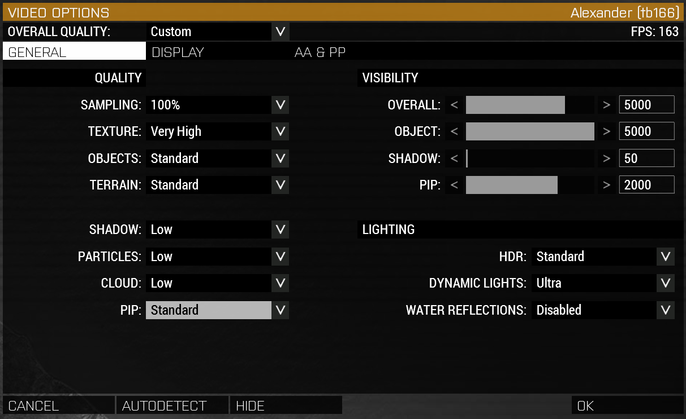
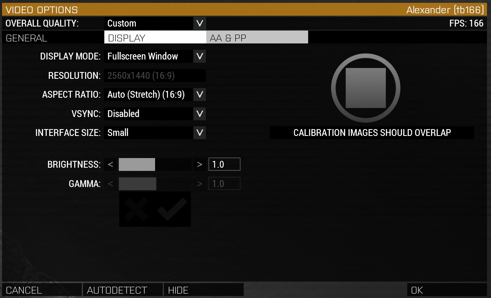
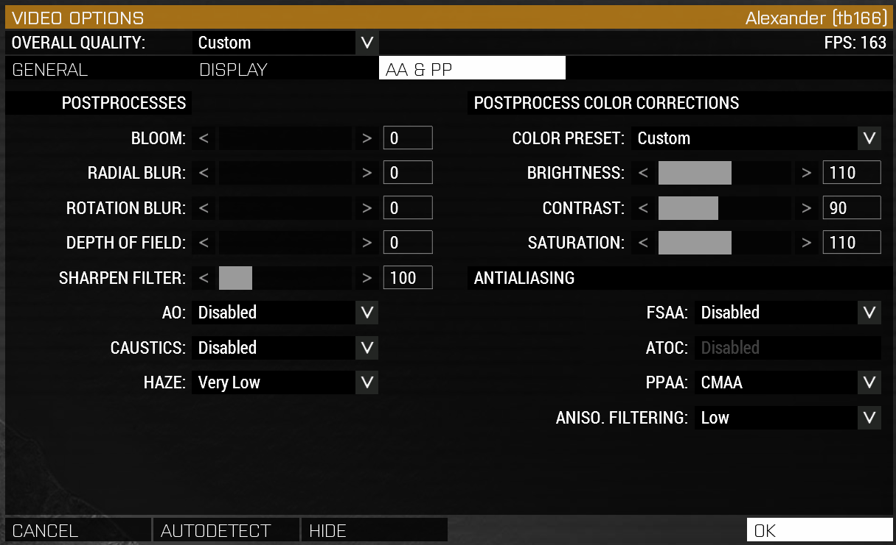

## Launcher Parameters

What launcher parameters you use depend on your computers specs

[Startup Parameters – Arma 3 - Bohemia Interactive Community (bistudio.com)](https://community.bistudio.com/wiki/Arma_3:_Startup_Parameters)

[Releases · GoldJohnKing/mimalloc (github.com)](https://github.com/GoldJohnKing/mimalloc/releases)

Custom memory allocator, claims to boost fps by up to 30%, ilbinek says he uses this on the TBD Event server (100-200 players)

Images

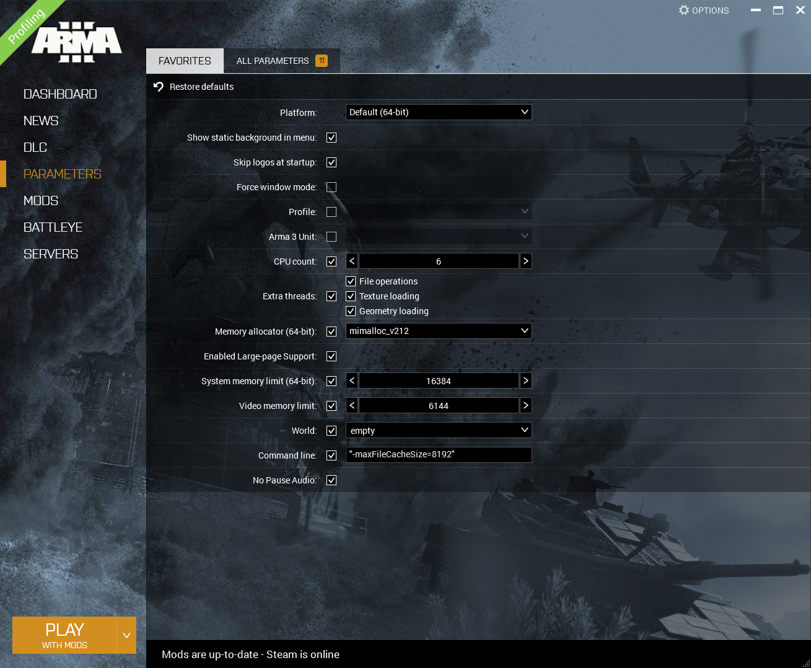

## Performance / Profiling Build

> The Profiling Branch is a test bed for changes to the game that are client-side only and compatible with the main branch, primarily performance improvements.

> There is no guarantee that there are no (game-breaking) issues on this branch, it is an experimental branch.

Basically gives more fps, but is slightly less stable/mod compatible (very rare)

Images

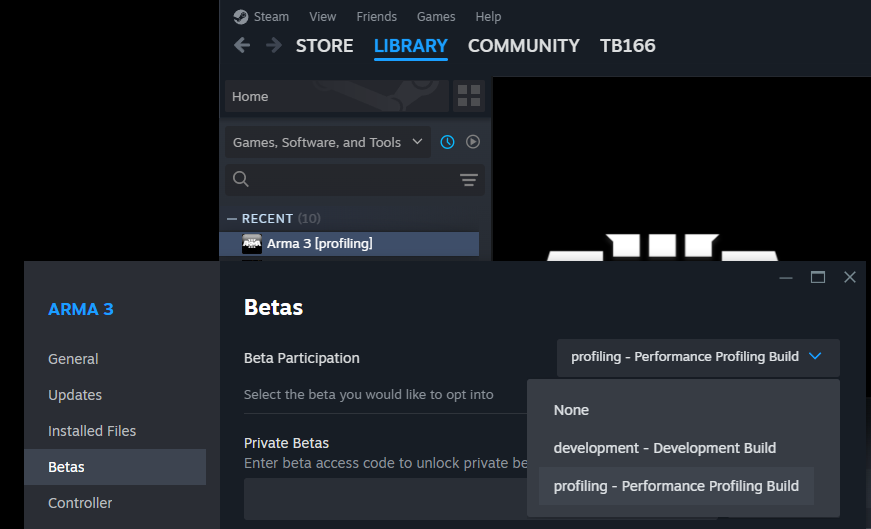

## Process Lasso

Process lasso reset my settings for arma, but just disabling hyperthreading on arma is what I had, maybe turn priority up to above normal

Images

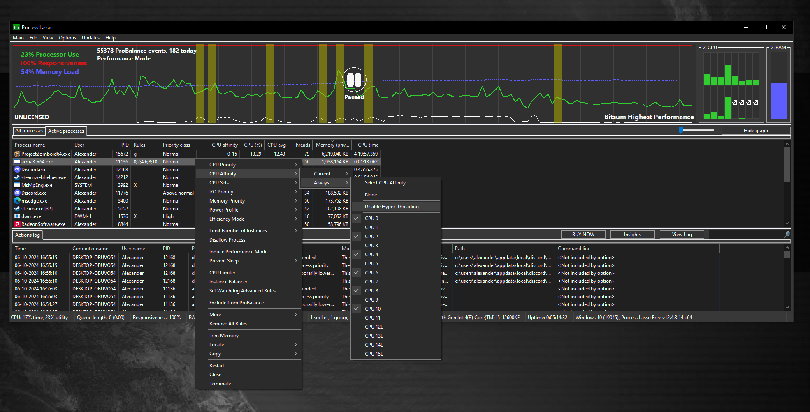

## Yet Another Arma Benchmark

[Steam Workshop::Yet Another Arma Benchmark (steamcommunity.com)](https://steamcommunity.com/sharedfiles/filedetails/?id=375092418)

From stock to fully configured, I gained about 10% more fps on a very heavy benchmark, while also having less severe fps drops/stutter/lag

Comments:
- params = launcher parameters on
- profiling = using profiling branch
- cold = 1st run usually gets lower fps
- warm = after 1st run
- cpu "oc" = I changed my cpu settings in my bios, but I don't think it gained any performance at all (my mobo is locked)
- gpu oc = power limit and memory timings maxed
- better gpu oc = above + 100% fan curve

Images

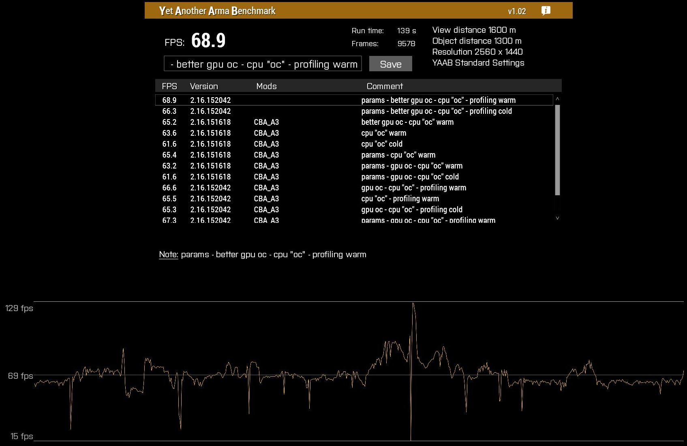
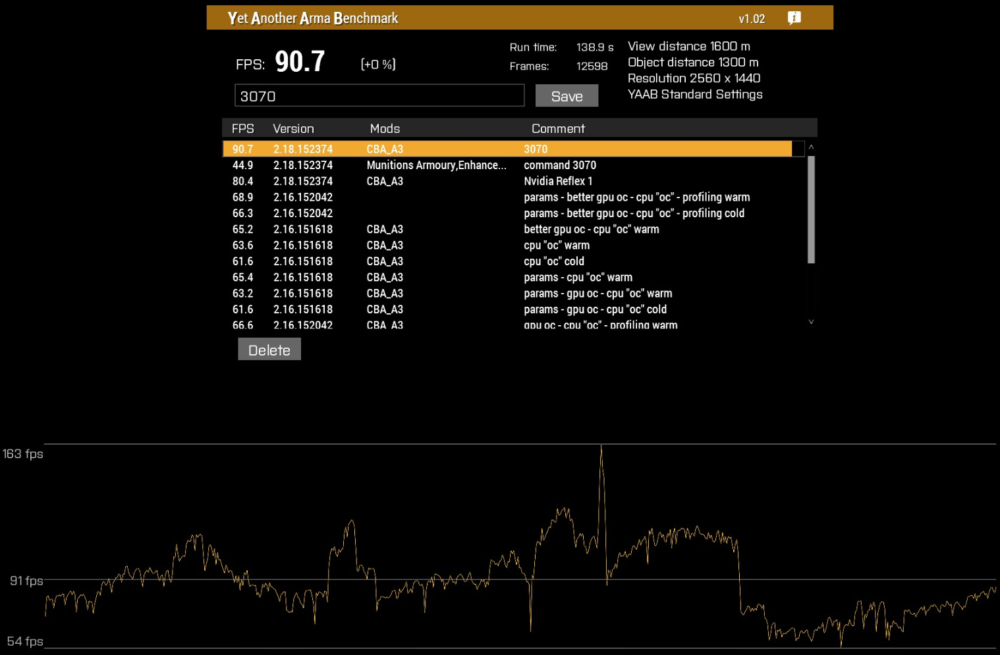

## Symlink Guide
20 seconds to main menu with no mods

I have my game on my main ssd, then mods on my hdd

To do it I made a symlink from
> F:\SteamLibrary\steamapps\workshop\content\107410

^ hard drive
to
> C:\Program Files (x86)\Steam\steamapps\common\Arma 3\!Workshop

^ ssd
Your setup may differ depending on where and how you have Steam installed

## How to clean your (unused) Arma 3 mods

1. Export/share mod presets you want to keep
2. Unsubscribe from all mods (there’s a button for it). Wait until 0 workshop mods appear in the launcher (You may have to press the button multiple times)
3. Delete the presets in the launcher (They will all be empty)
4. Import the presets you wanted to keep
5. Close the launcher
6. Wait until steam finishes updating Arma 3
7. Done

## ACE Volume

Q: I CAN'T HEAR ANYONE BECAUSE THE SHOOTING/VEHICLE IS TOO LOUD

A: ACE Volume
(THIS WILL WORK FOR ALMOST EVERY SERVER THAT USES ACE)
-> Addon Options
-> ACE Volume

Images

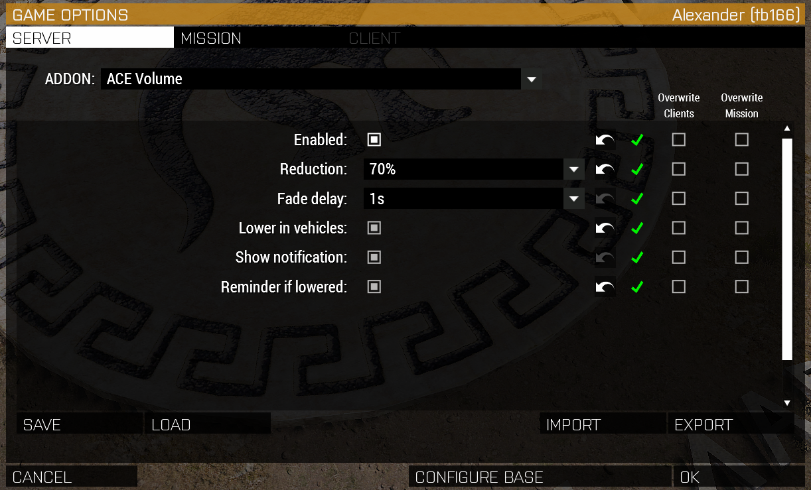

^ My personal settings
PART 2: Bind a key to toggle it manually!
-> Controls
-> Configure Addons
-> ACE Common
-> Toggle Volume

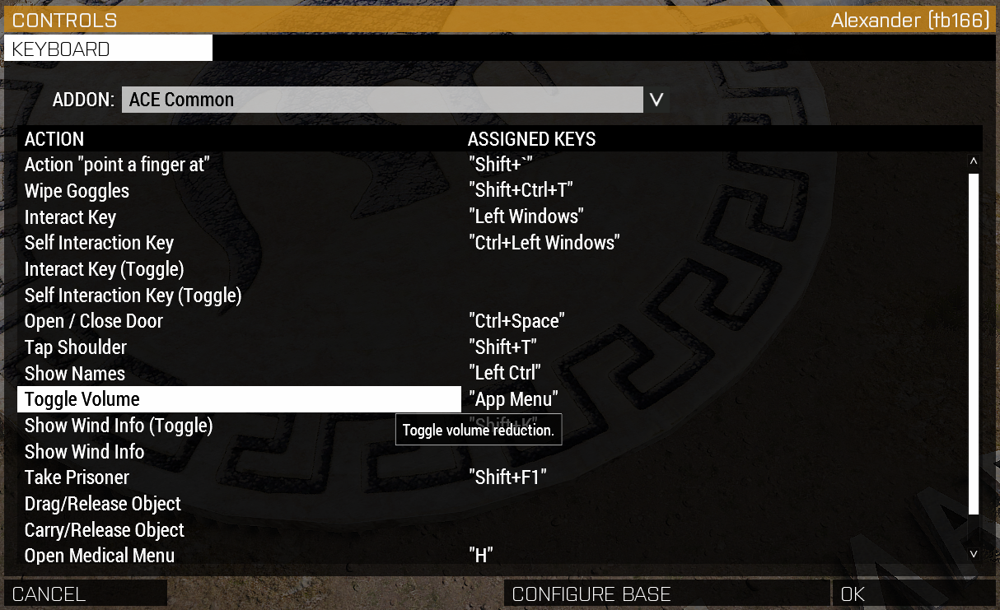

This is the App Menu key btw v (It's not commonly used) (Any other key will also work)

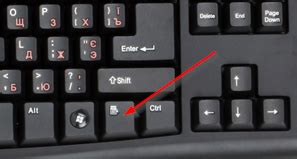

